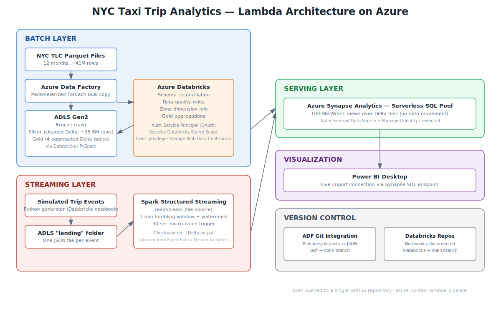

# NYC Taxi Trip Analytics — Azure Lambda Architecture Pipeline

An end-to-end data engineering project on Azure, built around the NYC TLC Yellow Taxi trip dataset. It implements a **Lambda architecture** — a batch layer for deep historical analysis and a streaming layer for near-real-time processing — across a full medallion (bronze/silver/gold) data lake, with a Synapse serverless SQL serving layer and a live Power BI dashboard.



## Architecture

```
                              ┌─────────────────────────────────────┐
                              │            BATCH LAYER               │
  NYC TLC Parquet files       │  ADF (parameterized, ForEach bulk)   │
  (12 months, ~41M rows)  ───▶│  → ADLS Bronze                       │
                              │  → Databricks/PySpark → Silver       │
                              │  → Zone join + aggregations → Gold   │
                              └──────────────────┬────────────────────┘
                                                  │
                              ┌───────────────────┴────────────────────┐
                              │           STREAMING LAYER               │
  Simulated trip events       │  Python event generator → JSON files   │
  (Databricks notebook)   ───▶│  → Spark Structured Streaming          │
                              │  → 1-min tumbling window aggregation   │
                              │  → Delta table                         │
                              └───────────────────┬────────────────────┘
                                                  │
                                                  ▼
                              Synapse Serverless SQL (views over Delta)
                                                  │
                                                  ▼
                                        Power BI Dashboard
```

## Tech Stack

| Layer | Technology | Purpose |
|---|---|---|
| Ingestion | Azure Data Factory | Metadata-driven, parameterized bulk ingestion (ForEach loop over 12 months) |
| Storage | Azure Data Lake Storage Gen2 | Medallion architecture (bronze / silver / gold / streaming) |
| Batch processing | Azure Databricks (PySpark) | Schema reconciliation, data quality rules, aggregations |
| Streaming processing | Spark Structured Streaming | Windowed aggregation over simulated real-time events |
| Serving | Azure Synapse Analytics (Serverless SQL) | SQL views directly over Delta Lake files, no data movement |
| Visualization | Power BI Desktop | Live dashboard connected to Synapse |
| Security | Microsoft Entra Service Principal, Managed Identity, Databricks Secrets | Least-privilege, credential-free access between services |
| Version control | Git (GitHub), ADF Git integration, Databricks Repos | Pipelines and notebooks version-controlled, not click-ops |

## What's in this repo

```
/adf                    → ADF pipeline, dataset, and linked service JSON definitions
/databricks             → Databricks notebooks (bronze→silver, silver→gold, streaming)
```

### Databricks notebooks

1. **01_bronze_to_silver_setup** — Establishes Service Principal (OAuth) authentication between Databricks and ADLS Gen2, following least-privilege access control.
2. **02_bronze_to_silver_transform** — Resolves schema drift across 12 months of source files (inconsistent types and column casing), applies explicit data quality rules, writes a clean Delta table (~35.6M rows from ~41.3M raw).
3. **03_silver_to_gold_aggregations** — Joins trip data with the TLC zone lookup dimension table and builds four business-facing gold tables.
4. **04_streaming_pipeline** — Simulates real-time trip events and processes them with Spark Structured Streaming, using tumbling windows and watermarking.

## Key Design Decisions

**Why Lambda architecture (batch + streaming), not just batch?**
Most portfolio projects using this dataset stop at batch. Implementing both layers demonstrates the trade-off explicitly: batch gives complete, accurate historical analysis; streaming gives low-latency, approximate, near-real-time views. Very few candidates can speak to both in the same project.

**Why explicit schema + per-file casting instead of `mergeSchema`?**
The raw TLC files have genuine schema drift across months — differing column types (`INT` vs `BIGINT`, `DOUBLE` vs `BIGINT`) and inconsistent column name casing (`airport_fee` vs `Airport_fee`). Spark's automatic `mergeSchema` failed outright on these conflicts. The robust fix was reading each month with its native schema, explicitly casting every column to a canonical target schema, and unioning — giving full control over the conversion instead of relying on implicit inference.

**Why Service Principal + OAuth over storage account keys?**
Account keys grant full access to an entire storage account and are a common leak vector. A Service Principal scoped to only "Storage Blob Data Contributor" on the specific storage account follows least-privilege — the same reasoning applied again for Synapse's Managed Identity when serving Power BI queries.

**Why did the streaming layer end up as Structured Streaming instead of Event Hubs + Stream Analytics?**
The project was originally built on Event Hubs → Stream Analytics → ADLS. In practice, the Stream Analytics job exhibited a persistent watermark-delay issue — the job's watermark climbed indefinitely and no output was ever emitted, even after:
- Confirming the Event Hub had a single partition (ruling out a common multi-partition watermark-stall cause)
- Verifying input events were arriving (confirmed via metrics)
- Testing the output connection independently (succeeded)
- Validating the query logic against sample data (succeeded)
- A full clean rebuild — new namespace, new Event Hub, new job, new input/output, new secrets

Event Hubs Capture was evaluated as an alternative but requires Standard tier (not available on Basic tier, used here for cost reasons). Rather than continue debugging a platform-level issue with no visibility into Azure's backend diagnostics, the project pivoted to a **file-based Spark Structured Streaming** approach: simulated events are written as individual JSON files to a landing zone, and a Structured Streaming job reads that folder incrementally, applying the same tumbling-window aggregation logic directly in code — with full visibility into watermarking and checkpointing, no opaque managed service in between.

This is a deliberate example of diagnosing a tooling limitation under time constraints and choosing a pragmatic, fully self-contained alternative that still demonstrates the same core streaming concepts (windowing, watermarking, incremental processing, checkpointed recovery).

**Why partition bronze/silver by year/month (Hive-style)?**
Enables partition pruning — downstream queries and Spark jobs filtering by date range can skip irrelevant files entirely instead of scanning the full dataset.

**Why left joins for the zone lookup, not inner joins?**
An inner join would silently drop any trip with a location ID not present in the lookup table, corrupting row counts without an obvious cause. A left join preserves every trip record, with zone fields simply null if unmatched — a safer default for a fact table join.

**Why Synapse Serverless SQL instead of a Dedicated SQL Pool?**
Serverless bills per-TB-scanned with no provisioned, always-on compute — appropriate for a gold layer that's a few hundred MB at most. A dedicated pool would introduce constant hourly cost for no benefit at this scale.

## Data Quality Rules Applied (Bronze → Silver)

| Rule | Reasoning |
|---|---|
| Drop null/zero `passenger_count` | A trip with zero or unknown passengers isn't usable for demand analysis |
| Drop `trip_distance` ≤ 0 or > 100 miles | Removes invalid and clearly erroneous outlier trips |
| Drop `fare_amount` ≤ 0 or > $500 | Removes refund/correction artifacts and data entry errors |
| Drop negative `tip_amount` | Negative tips are refund/correction artifacts, not real trips |
| Convert `RatecodeID = 99` to null | TLC's own placeholder for "unknown," not a real rate category — corrected rather than filtered, since it doesn't invalidate the rest of the trip record |

## Results

- **~41.3M raw trip records** ingested across 12 months (2023), reduced to **~35.6M clean records** after data quality rules (~7% removed, consistent with expected null/invalid rates in the source data).
- Four gold aggregation tables answering: monthly trend, revenue by borough/hour, tip behavior by payment type, and busiest pickup zones.
- A working streaming layer producing 1-minute windowed aggregations with sub-2-minute latency from simulated event to queryable Delta output.

## CI/CD Approach

This project uses **Git integration** (ADF Git mode + Databricks Repos), which gives version control and history, but is not by itself CI/CD — it's the prerequisite for it. Here's how automated deployment would be layered on top, using GitHub Actions:

**ADF: deploy pipeline changes automatically**
1. ADF's Git integration already exports every pipeline/dataset/linked service as JSON into `main` on every publish.
2. A GitHub Actions workflow, triggered on push to `main` under `/adf/**`, would:
   - Check out the repo
   - Use the `Azure/data-factory-deploy-action` (or the ARM template generated on the `adf_publish` branch) to deploy the updated pipeline definitions to a target Data Factory instance
   - Optionally run against a **dev** Data Factory first, requiring manual approval before promoting to a **prod** instance
3. This replaces manually clicking "Publish" in ADF Studio — the deployment becomes a repeatable, auditable step in the pipeline.

**Databricks: deploy and test notebooks automatically**
1. A workflow triggered on push under `/databricks/**` would use the **Databricks CLI** (via a GitHub Actions step, authenticated with a service principal / workspace token stored as a GitHub secret) to:
   - Sync the updated notebooks into the target workspace (`databricks workspace import`)
   - Optionally trigger a **Databricks Job** run against a small sample dataset as an automated smoke test, failing the workflow if the notebook errors
2. For the Structured Streaming notebook specifically, a CI check could validate the schema definition and windowing logic against a small fixture file before deploying, catching schema mismatches before they reach a real cluster run.

**Why this wasn't fully built out here**
Setting up genuine multi-environment (dev/prod) CI/CD requires at least two parallel sets of Azure resources (a second Data Factory, a second Databricks workspace) to deploy *between* — not practical to provision twice on a single free-tier subscription. The Git integration piece (the actual prerequisite for CI/CD) is implemented and working; the deployment automation on top is described here as the logical next step, and is a natural thing to build out further if this project is extended.

## Possible Extensions

- Full CI/CD implementation across dev/prod environments for ADF and Databricks (see `/cicd/adf-deploy.yml` for an example GitHub Actions workflow)
- Incremental (delta) loading instead of full-year batch reload
- Managed Identity throughout (currently mixed with connection-string auth in a couple of lower-risk internal-only connections, documented above)
- Demand forecasting model (attempted during this build; deprioritized after evaluation showed the model wasn't learning per-borough patterns correctly — a good example of not shipping a model that doesn't hold up under evaluation)

---

*Built as a portfolio project to demonstrate end-to-end Azure data engineering: ingestion, transformation, streaming, serving, and visualization, with attention to security, cost, and data quality throughout.*
